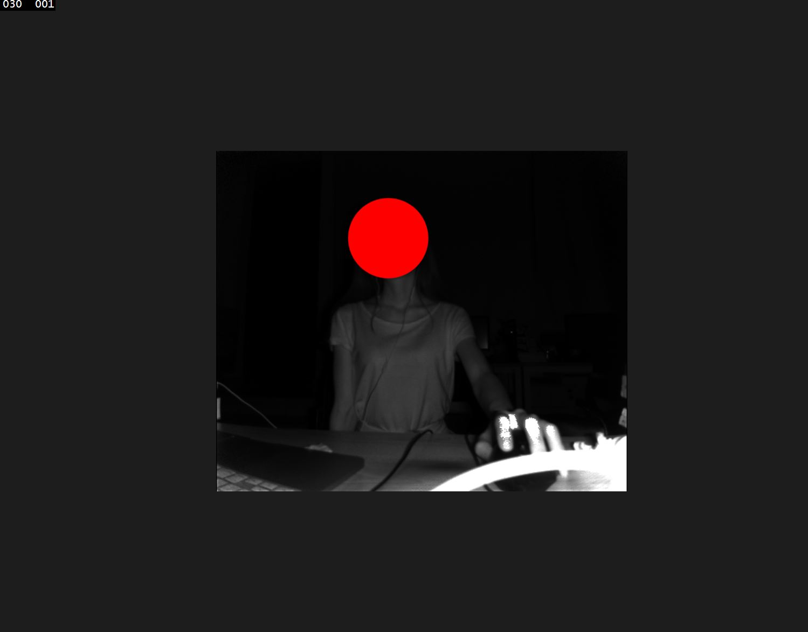

# GetInfraredPic

> 记录一下最近学的东西

* Kinect如何获取深度数据
* Kinect获取到深度数据后如何检测出人物
* 如何处理Kinect获取的数据
* Kinect Hand Point Gesture
* Kinect Speech
* Kinect + Unity
* Kinect Gesture Builder（之前对此有一些了解，还是想更深入）
* Kinect FaceTracking
* 一些图形处理的基础
